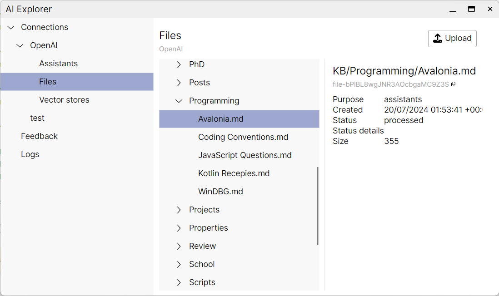

# AIExplorer

AIExplorer is a simple tool to help you explore the OpenAI API and manage your data and models.

It is build with .NET 8, Avalonia and ReactiveUI. It is available only for Windows at the moment.

Currently it supports the following endpoints:

- Assistants
- Files
- Vector storages

It is a work in progress and more endpoints will be added in the future, conditional on your feedback.

Some functionality of the AIExplorer overlaps with the OpenAI playground. However, the AIExplorer is designed to be better connected to the local filesystem and to be more flexible in terms of the data it can handle.

The current release 0.1.0 is a preview version and is not feature complete.

If you are interested in the project, e.g. have a feature request or need to customise the tool for your needs, please get in touch by using this form [AIExplorer Feedback](<https://docs.google.com/forms/d/e/1FAIpQLScvbme5WtIagmrxXe2YhK6HQDU14uNNTsz22-HHBhI7LtFUqQ/viewform>).
